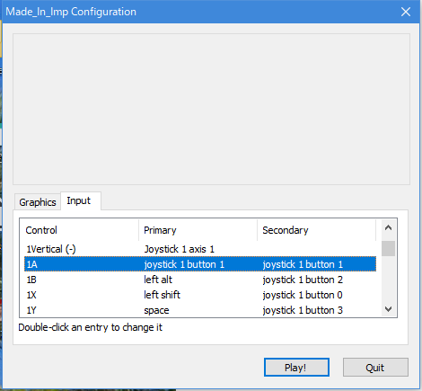

# メイドインインプの遊び方

このゲームはコントローラーを2つ使用します。遊ぶまでに設定を行ってください。

`1A` は1PのAボタンを意味します。

`1A``1L``1R``2A``2L``2R`に対して、Primaryの欄をダブルクリックした後に該当するキーを押すことで設定を行ってください。

**ダブルクリックした直後に、直前に押したキーが設定されてしまう不具合があるようです。**

ガイダンスの前に必ず動作確認をお願いします。
