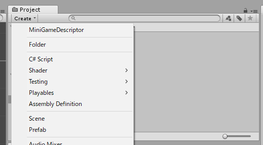
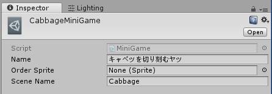

# 芸工へ行こう impression!企画　メイドインインプ（仮称）

## 概要
このゲームは以下のようなゲームの寄せ集めです
* メイドインワリオのような5秒程度で成功/失敗の決まるゲーム
* 左右2つに画面分割を行う
* ゲームパッド(スーファミ風:ABXY, 十字キー, LRを搭載)を用いる
* 2人対戦はしない

なおUnity製です
Unityのバージョンは**2017.4.0**(2018/03/24時点での最新)です

ターゲットディスプレイ解像度は**フルHD(1920x1080)**です。

## プロジェクトにコントリビュートするには

SkypeID:wararyo02にGitHubIDを教えてください
メールが届くのでそこAcceptするとこのリポジトリにプッシュすることができます。

## 開発の手順

1. Cloneします
2. そのゲーム専用のブランチを作ります。複数のブランチを作る場合はそのブランチ名をプレフィックスとしてください。(例:RendaブランチとRenda-Characterブランチ)
3. 作ったブランチでAssets以下にゲーム名のフォルダを作ります。(例:Assets/Renda)全てのファイルはそのフォルダ内に入れてください。
4. 開発のキリがついたらプルリクエストを投げてください。
5. 定期的にmasterでの変更を自分のブランチにマージしておくのがオススメです。

わからないことがあったらSkypeID:wararyo02やTwitter:warabi_taroに聞いてください。

## コマンダーとの通信

各ミニゲームからの勝敗情報を受け取ったり、勝敗に応じた画面(コントローラーを交代する画面)を表示する部分を「コマンダー」と呼びます。

### 成功/失敗
ゲームの成功が決まった時は以下を実行してください。
``` C#
//1Pが成功した時
Commander.Succeed(0);
//2Pが成功した時
Commander.Succeed(1);
```
ゲームの失敗が決まった時は以下を実行してください。
``` C#
//1Pが失敗した時
Commander.Failed(0);
//2Pが失敗した時
Commander.Failed(1);
```

なお、一回SucceedもしくはFailedを実行した場合、以降の成功/失敗の変更はできません。
すなわち、
``` C#
Commander.Succeed(0);
Commander.Failed(0);
```
とした場合、1Pはミニゲームに成功した扱いとなります。

ミニゲーム終了までにどちらも実行されなければ失敗扱いとなります。

## 入力

Input設定は変更しないでください。
コントローラーは左右スティックを搭載しないものを使用する予定です。

1PのAボタンが押された時に何かをしたい場合は、以下のようにします。
``` C#
void Update(){
  if(Input.GetButtonDown("1A")){
    // Do Something
  }
}
```

それぞれのキーを表す文字列については、Edit>Project Settings>Inputをご覧ください。

## ミニゲーム定義ファイルの作成
それぞれのミニゲームフォルダ内にてCreate>MiniGame Definitionよりミニゲーム定義ファイルを作成してください。  


インスペクターにてNameとScene Nameを記入します。 Nameはミニゲーム名(日本語可, テキトーでいいです)、Scene Nameは読み込んでほしいSceneの名前です。  


## そのほかTips
気づいたことがある人は誰でも書き込んでください。

### Spriteをドットbyドット表示にする方法
カメラのSizeを5.4にします。
5.4というのは[画面の縦解像度1080]/2/[SpriteのPixel Per Unitの初期値100]により算出された値です。

### 最後までFailしなかったら勝利にしたい
避けゲーなどで最後まで耐えたら成功、としたい場合は`Commander.onMinigameEnd`を用います。

``` C#
void Start () {
    Commander.onMinigameEnd += onMinigameEnd;
}

void onMinigameEnd(){
    Commander.Succeed(0);
    Commander.Succeed(1);
}
```
もちろんラムダ式を用いてもOKです。
``` C#
void Start () {
    Commander.onMinigameEnd += () => {
        Commander.Succeed(0);
        Commander.Succeed(1);
    };
}
```

## スタッフ(敬称略)
### グラフィック
すな子
nafy
紅葉
みっつー

### サウンド
ののの
ちゃー

### プログラム
わらび
つつみん
バード
なおてぃ

